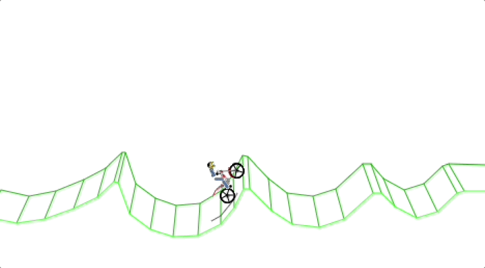

# Gravity Defied Web

**Gravity Defied** is a legendary mototrial racing mobile game. It was originally developed by Codebrew Software in 2004 for J2ME platform.

This is a web browser port of Gravity Defied, written in TypeScript using Vite as the build tool. The project includes all the features of the original game and runs directly in modern web browsers.

🎮 **Play online:**  
https://yurkagon.github.io/gravity-defied-web/



## Controls

| Key | Action |
|----|----|
| ↑ / ↓ | Accelerate / Brake |
| ← / → | Lean rider backward / forward |
| W / S | Accelerate / Brake |
| A / D | Lean rider backward / forward |
| Enter | Select menu item |
| Escape | Pause game |

## About

This project is a browser-based port of the classic Gravity Defied game. It's built using:
- **TypeScript** - for type-safe code
- **JavaScript** - for runtime execution
- **Vite** - for fast development and building
- **HTML5 Canvas** - for rendering the game graphics

The project is based on the C++ & SDL2 port: [gravity_defied_cpp](https://github.com/rgimad/gravity_defied_cpp)

## Disclaimer

**This Project is not associated with Codebrew Software in any fashion. All rights to the original Gravity Defied, it's name, logotype, brand and all that stuff belong to Codebrew Software.**

## Getting Started

### Prerequisites

- Node.js (v18 or higher recommended)
- npm or yarn

### Installation

```bash
npm install
```

### Development

Start the development server:

```bash
npm run dev
```

The game will be available at `http://localhost:3000`

### Build

Build the project for production:

```bash
npm run build
```

The built files will be in the `dist` directory.

### Preview

Preview the production build:

```bash
npm preview
```

## Project Structure

```
gravity-defied-web/
├── src/                         # Source code
│   ├── app.ts                  # Fullscreen game bootstrap
│   ├── runtime/                # Game loop, resize, input, and browser wiring
│   ├── main.ts                 # Application initialization
│   └── ...                     # Physics, menus, rendering, storage, etc.
├── index.html       # HTML entry point
├── vite.config.ts   # Vite configuration
└── package.json     # Dependencies and scripts
```

## Fullscreen Desktop Build

The current build is now focused on a pure game-only desktop presentation:

- The original bike physics loop remains intact.
- The app opens directly into the game instead of a surrounding website shell.
- The canvas fills the full desktop viewport.
- The runtime uses hi-DPI rendering and an enlarged gameplay scale for sharper fullscreen play.
- The stage now supports both arrow-key and `WASD` play styles.
- All tracks and leagues are unlocked from the start.

This keeps the classic feel while pushing the presentation toward a cleaner fullscreen desktop experience.

## Technologies

- **TypeScript** - Type-safe JavaScript
- **Vite** - Next generation frontend tooling
- **HTML5 Canvas** - 2D graphics rendering
- **ESLint** - Code linting

## Topics

`gravity-defied` `game` `mototrial` `racing` `browser-game` `typescript` `vite` `canvas` `web-game` `retro-game` `j2me-port`

## License

This project is licensed under the GNU General Public License v2.0 (GPL-2.0). See [LICENSE.md](LICENSE.md) for the full license text.

## Contributing

Contributions are welcome! Feel free to open issues or submit pull requests.
# gravity-defied-new-release-2026
# gravity-defied-new-release-2026
